# Provisioning and deploying a web application to cPanel with GitHub Actions

This demonstration project shows how a web application might be deployed to a cPanel web hosting service.
Once SSH access has been enabled, the GitHub Actions workflow will provision a subdomain and a NodeJS
application. It will then deploy the front-end (web) and back-end (node app) to the cPanel hosting
service.

## Pre-requisites

- cPanel hosting service using CloudLinux with SSH access and NodeJS applications enabled.
- Base domain already configured for the sub-domain you wish to host from.
- - For example, if you plan to host your web application at https://myapp.example.com, you should already
    have the domain, example.com, created in cPanel.
- You need to know the hostname, port and username for establishing an SSH connection to your cPanel hosting
  server. You web hosting provider will be able to provide these.
- - The port is likely 22 or 722.
- VS Code with the [Dev Containers extension](https://marketplace.visualstudio.com/items?itemName=ms-vscode-remote.remote-containers).
  - This implies use of Docker to run the Dev Container described by this project.

Web hosting providers using cPanel can choose from a wide variety of underlying service opions. In
particular, this demonstration is intended to work with cPanel hosting services utilising CloudLinux.

You can tell if your cPanel service uses CloudLinux by checking if you have the Setup NodeJS option in
the Software section of your cPanel control panel.
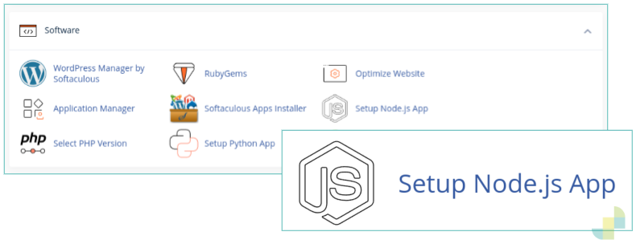

Likewise, you can tell if your cPanel service has enabled SSH access by checking if you have the SSH Access option in the Security section of your
cPanel control panel.
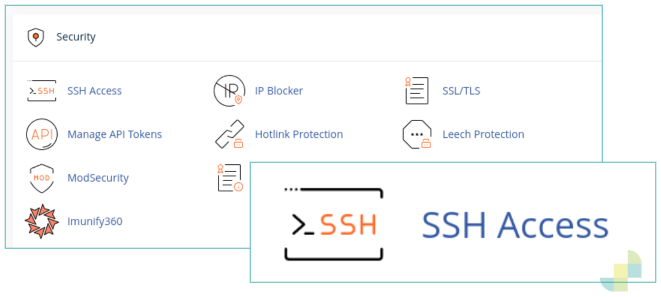

### Dev Containers

This project describes a Dev Container which ensures the appropriate build environment and other tools are
available. You can still use this project without Dev Containers, but you will need to ensure that the
tools are available in your environment. The easier path is to stick with the Dev Container if that option
is open to you.

## Run the demo

### Fork the project and open the Dev Container in VS Code

[Fork this repository](https://docs.github.com/en/pull-requests/collaborating-with-pull-requests/working-with-forks/fork-a-repo#forking-a-repository) on GitHub and then [clone it to your desktop](https://docs.github.com/en/pull-requests/collaborating-with-pull-requests/working-with-forks/fork-a-repo#cloning-your-forked-repository).

Open the cloned project in VS Code, and then choose the _Reopen in Container_ option displayed shortly after VS Code opens. The same option can be selected from the Command Palette (Ctrl-Shift-P).
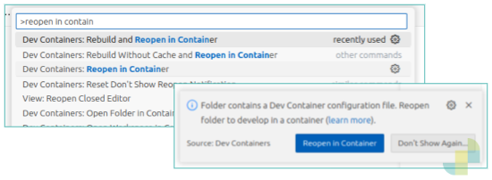

### Configure SSH access to cPanel

Once the project has opened in a Dev Container, open a bash terminal, change directory to tools and then copy
the file `.env.template` to `.env`.
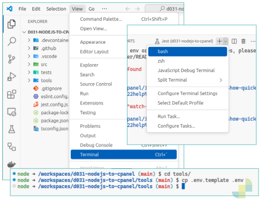

Edit `tools/.env` to populate the `HOSTING_SSH_HOST`, `HOSTING_SSH_HOST_PORT` and `HOSTING_SSH_USER` variables with
values appropriate to your cPanel host.
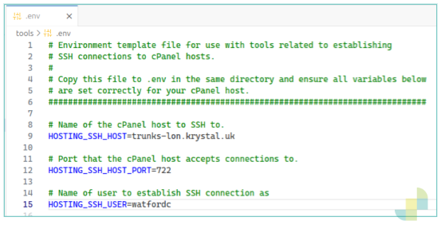

Next we generate a public/private key pair using a script in the tools directory. The keys will be used to
authenticate SSH access to cPanel. To generate the key pair, in the terminal, run `sh gen-cpanel-keys`.
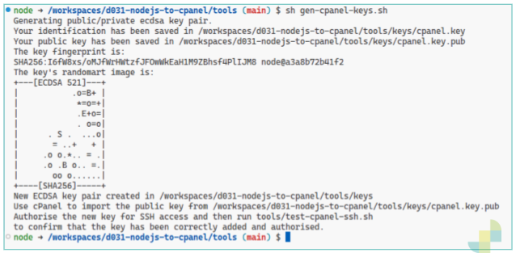

The above script creates files containing public and private keys in directory, tools/keys.

The script also creates an SSH config file in the tools/keys directory describing specifying that the private
key should be used to authenticate to the cPanel host. A script is provided which uses the configuration
file and the private key to test whether SSH access has been correctly configured for the cPanel host.
Run this script using `sh test-cpanel-ssh.sh`. The script will fail since we have not yet configured cPanel
with the new public key.
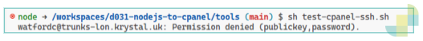

To configure SSH access to cPanel, select the SSH Access option from the cPanel control panel's Security section.

At the SSH Access screen in cPanel, click on the Manage SSH Keys button, and then click on the Import Key button.

At the Import SSH Key screen in cPanel, enter a name for the key and then paste the public key into the form.
The public key can be found in `tools/keys/cpanel.key.pub`.

Click the Import button and then follow the link Back to Manage Keys.
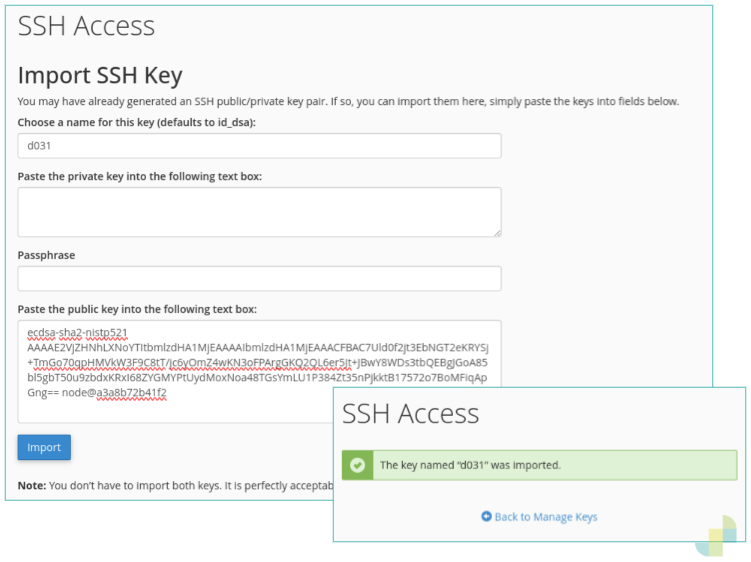

With the new public key imported, we now need to _authorise_ that key to be used to authenticate SSH access.

Find the new key in the list of Public Keys and click the Manage link.

Click the Authorize button to allow the public key to be used to authenticate SSH connections.
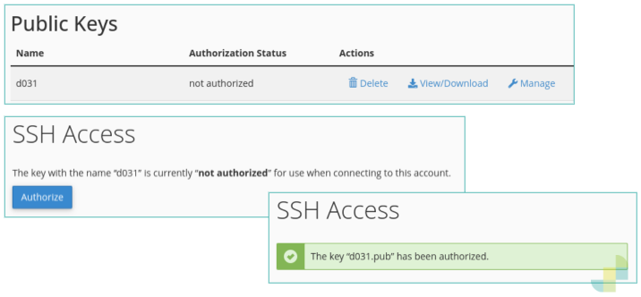

Back in the VS Code terminal, we can now test our SSH access again. Running `sh test-cpanel-ssh.sh` you should
now see a successful result.
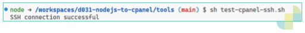

## Configure GitHub Repository Secrets and Variables

The GitHub Actions workflow makes use of various variables and secrets to control the cPanel provisioning
and deployment process.

Set the following [secrets](https://docs.github.com/en/actions/security-for-github-actions/security-guides/using-secrets-in-github-actions#creating-secrets-for-a-repository) and [variables](https://docs.github.com/en/actions/writing-workflows/choosing-what-your-workflow-does/store-information-in-variables#creating-configuration-variables-for-a-repository) on your repository.

### Repository Secrets

| Secret                  | Description                                                                                                          |
| ----------------------- | -------------------------------------------------------------------------------------------------------------------- |
| HOSTING_SSH_PRIVATE_KEY | Content of the private key for SSH authentication to cPanel. Use the contents of `tools/keys/cpanel.key.singleline`. |

### Repository Variables

| Variable                      | Example            | Description                                                                                                                   |
| ----------------------------- | ------------------ | ----------------------------------------------------------------------------------------------------------------------------- |
| HOSTING_APP_DOMAIN            | example.com        | The base domain to deploy the web app to. This is combined with `HOST_APP_SUBDOMAIN` to determine the full deployment domain. |
| HOSTING_APP_SUBDOMAIN         | webapp             | The subdomain to deploy the web app to. Combined with `HOSTING_APP_DOMAIN` to determine the full deployment domain.           |
| HOSTING_SSH_HOST              | cpanel.hosting.com | The hostname of the cPanel host to deploy to.                                                                                 |
| HOSTING_SSH_HOST_PORT         | 722                | The port on the cPanel host to establish an SSH connection to.                                                                |
| HOSTING_SSH_USER              | theuser            | The user to make the SSH connection as.                                                                                       |
| HOSTING_APP_INSTALL_DIRECTORY | apps/webapp        | The path on the cPanel host's filesystem to install the node application's file to.                                           |
| HOSTING_WEB_INSTALL_DIRECTORY | webapp.files       | The path on the cPanel host's filesystem to install the web front-end files to.                                               |

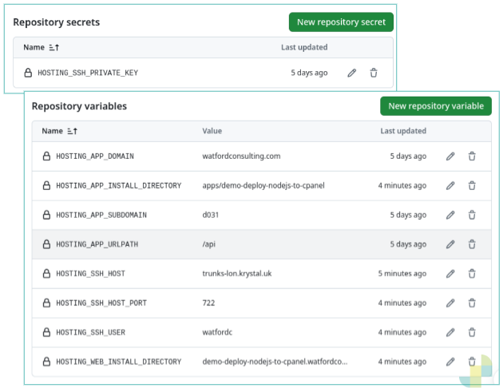

## Enable GitHub Actions Workflows

When a repository is forked on GitHub, Workflows are normally disabled by default.

Before enabling workflows, you should review the contents of `.github/workflows` to ensure you
are satisfied they are safe to run.

To enable workflows, click the Actions tab for your repository and then click the _I understand
my workflows, go ahead and enable them_ button.

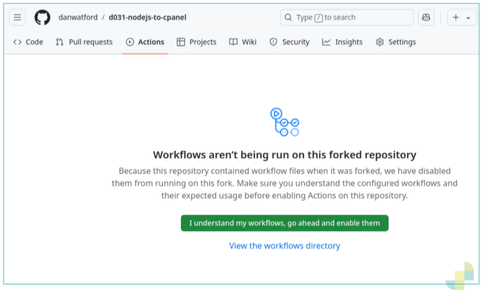

## Run the deployment GitHub Actions Workflow

Once actions are enabled for your GitHub repository, the Actions tab should show the list of
workflows available from the `.github/workflows` directory.

Select the `Build and deploy to web cPanel with CloudLinux` workflow and then click the
`Run workflow` button to launch the workflow.

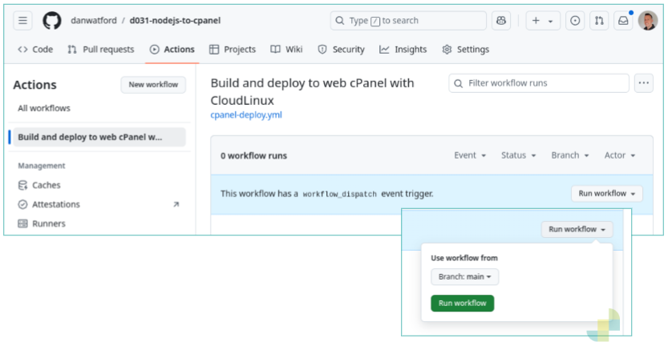

You can click through to view the workflow run and the results of each step in the workflow.
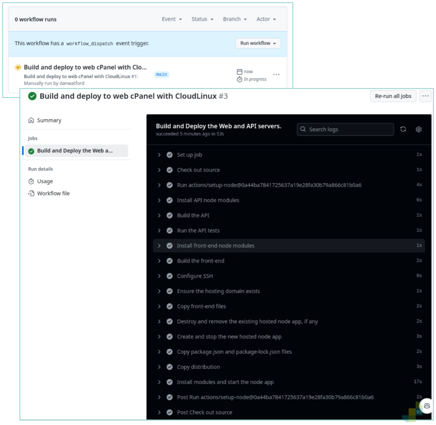

## Test the deployment

In your browser, visit the full deployment domain (i.e. combination of subdomain and domain).

In our example we visit https://d031.watfordconsulting.com/ and see the demo web application's _Roll_ button.

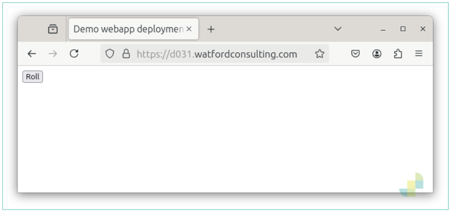

Repeatedly clicking the Roll button will cause the web app to POST to the node app API to trigger
generation of a random number between 1 and 6.

Each time the API response, it will include the last 10 rolls generated, demonstrating that state is maintained in the node app.

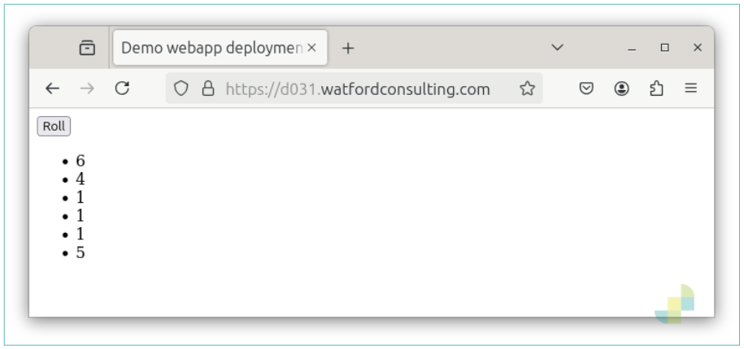

# Conclusion

If you have successfully followed the above walkthrough, you should have seen the workflow do the following on your cPanel host:

- create your deployment domain
- create the NodeJS application and associate it with the deployment domain
- build and deploy the NodeJS application
- build and deploy the web front-end.

The aim of this demo repository is to explore what aspects of cPanel hosting can be configured through scripting.
It is also possible to use this approach to create MySQL/MariaDB databases which may be something your web application depends on.

Please raise any issues if you encounter problems.

Please create PRs if you have any improvements you would like to see.
